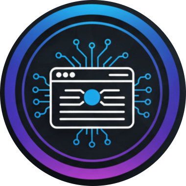
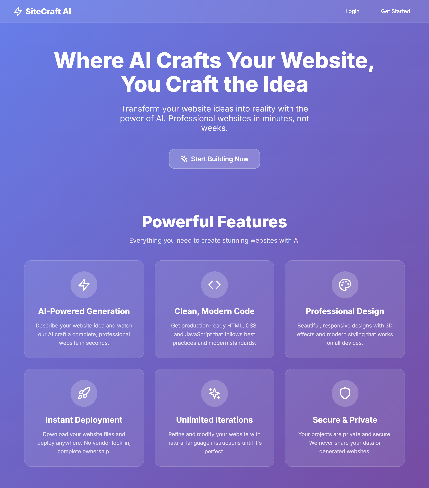
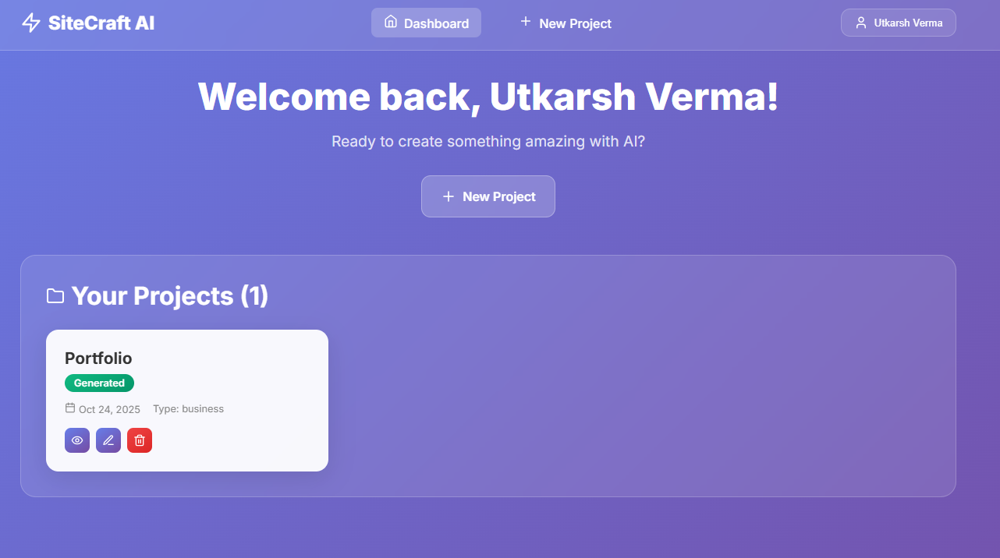
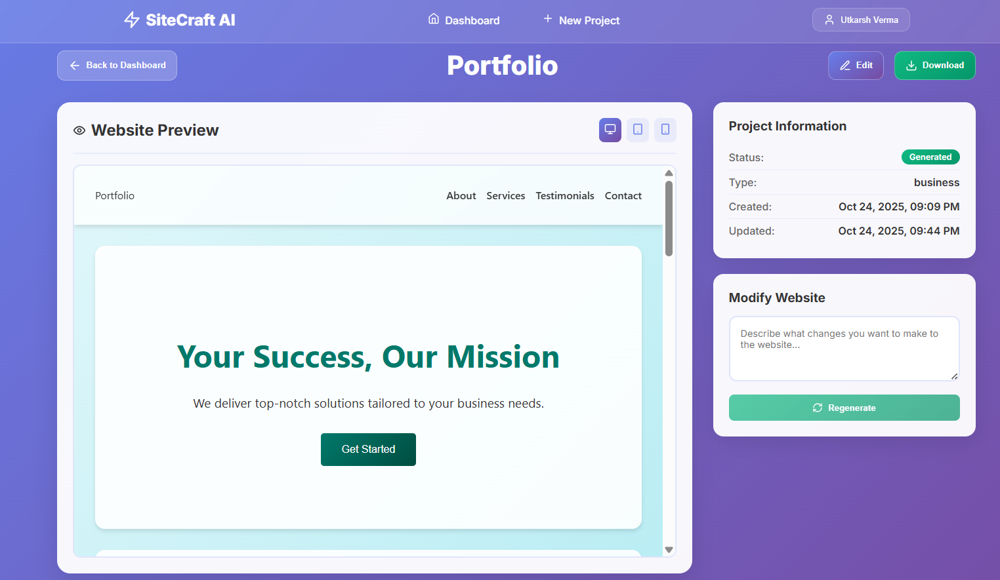
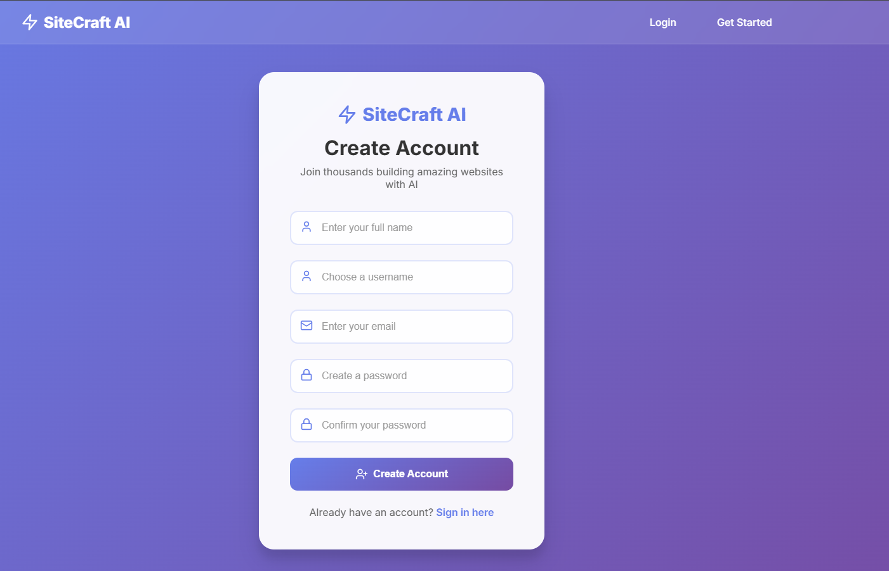
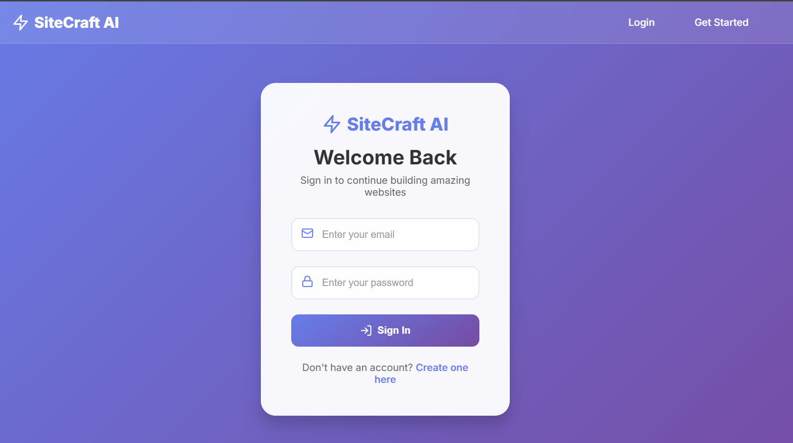
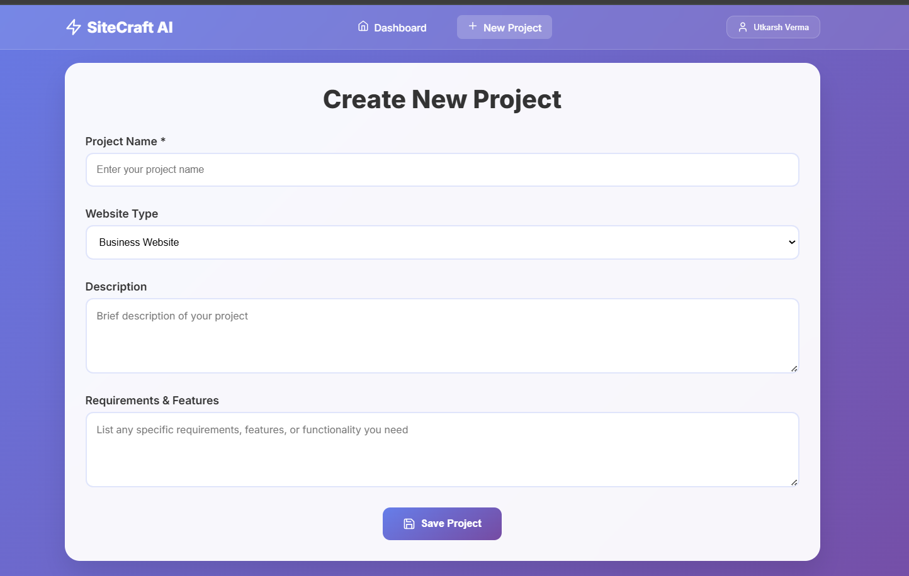

# 🚀 SiteCraft AI - AI-Powered Website Builder

<div align="center">



**Where AI Crafts Your Website, You Craft the Idea**

[](https://reactjs.org/)
[](https://flask.palletsprojects.com/)
[](https://python.org/)
[](https://openrouter.ai/)
[](LICENSE)

</div>

SiteCraft AI is a revolutionary website builder platform that harnesses the power of artificial intelligence to generate complete, responsive websites from simple text descriptions. Transform your ideas into professional websites in minutes, not weeks.

## ✨ Live Demo



## 🎯 Key Features

### 🤖 AI-Powered Generation
- **Natural Language Processing**: Describe your website in plain English
- **Intelligent Prompt Generation**: Auto-generates optimized prompts based on project details
- **Multiple Website Types**: Business, Portfolio, Blog, E-commerce, Landing Pages, and more
- **Industry-Specific Templates**: Tailored designs for different business sectors

### 🎨 Professional Design System
- **Modern 3D Effects**: Glassmorphism, shadows, and smooth animations
- **Responsive Design**: Perfect rendering on desktop, tablet, and mobile devices
- **Professional Color Schemes**: Industry-appropriate color palettes
- **Typography Excellence**: Clean, readable fonts with proper hierarchy

### 🔐 Secure User Management
- **JWT Authentication**: Secure token-based authentication system
- **User Profiles**: Personalized dashboards and project management
- **Session Management**: Secure login/logout with proper session handling
- **Data Privacy**: Your projects and data remain completely private

### 📱 Multi-Device Preview


- **Real-time Preview**: See your website as you build it
- **Device Simulation**: Desktop, tablet, and mobile preview modes
- **Interactive Testing**: Test functionality before download

### 🔄 Iterative Development


- **Natural Language Modifications**: "Make it blue" or "Add a contact form"
- **Version History**: Track all generations and modifications
- **Instant Updates**: See changes applied in real-time
- **Unlimited Iterations**: Refine until perfect

## 📸 Screenshots

### User Authentication
<div align="center">


</div>

### Project Creation & Management
<div align="center">


</div>

### AI Website Generation


## 🛠️ Technology Stack

<div align="center">

| Frontend | Backend | Database | AI/ML |
|----------|---------|----------|-------|
|  |  |  |  |
|  |  |  |  |
|  |  |  |  |

</div>

### 🎨 Frontend Architecture
- **React 18** with Hooks and Context API
- **Styled Components** for CSS-in-JS styling with 3D effects
- **Framer Motion** for smooth animations and transitions
- **React Router** for client-side routing and navigation
- **Axios** with interceptors for API communication
- **React Hot Toast** for beautiful notifications

### ⚙️ Backend Architecture
- **Flask** lightweight web framework with blueprints
- **Flask-JWT-Extended** for secure authentication
- **Flask-CORS** for cross-origin resource sharing
- **SQLite** with automatic schema initialization
- **RESTful API** design with proper HTTP status codes

### 🤖 AI Integration
- **OpenRouter API** for accessing multiple AI models
- **DeepSeek V1** as the primary language model
- **Custom prompt engineering** for optimal website generation
- **Intelligent context management** for better results

## 🚀 Quick Start Guide

### 📋 Prerequisites

Before you begin, ensure you have the following installed:

- **Python 3.8+** ([Download](https://python.org/downloads/))
- **Node.js 16+** ([Download](https://nodejs.org/))
- **Git** ([Download](https://git-scm.com/))
- **OpenRouter API Key** ([Get Free Key](https://openrouter.ai/keys))

### 📥 Installation

#### 1. Clone the Repository
```bash
git clone https://github.com/utkarshverma439/SiteCraft-AI.git
cd SiteCraft-AI
```

### 2. Backend Setup
```bash
# Navigate to backend directory
cd backend

# Create virtual environment
python -m venv venv

# Activate virtual environment
# On Windows:
venv\Scripts\activate
# On macOS/Linux:
source venv/bin/activate

# Install dependencies
pip install -r requirements.txt

# Create environment file
copy .env.example .env
# Edit .env file with your configuration
```

### 3. Frontend Setup
```bash
# Navigate to frontend directory
cd frontend

# Install dependencies
npm install

# The frontend will use proxy to connect to backend
```

#### 4. Environment Configuration

Create a `.env` file in the root directory:

```env
# Backend Configuration
SECRET_KEY=your-super-secret-key-change-this-in-production
JWT_SECRET_KEY=your-jwt-secret-key-change-this-too
FLASK_ENV=development

# OpenRouter AI Configuration
OPENROUTER_API_KEY=your-openrouter-api-key-here

# Frontend Configuration (Optional)
REACT_APP_API_URL=http://localhost:5000/api
```

#### 5. Get Your Free OpenRouter API Key

1. 🌐 Visit [OpenRouter.ai](https://openrouter.ai/)
2. 📝 Sign up for a free account
3. 🔑 Navigate to the "Keys" section
4. ➕ Generate a new API key
5. 📋 Copy the key (starts with `sk-or-v1-...`)
6. 📄 Add it to your `.env` file

> 💡 **Tip**: OpenRouter provides free credits for testing!

#### 6. Launch the Application

Open **two terminal windows**:

**🖥️ Terminal 1 - Backend Server:**
```bash
cd backend
python app.py
```
✅ Backend will start on `http://localhost:5000`

**🌐 Terminal 2 - Frontend Server:**
```bash
cd frontend
npm start
```
✅ Frontend will start on `http://localhost:3000`

#### 7. Access SiteCraft AI

🎉 Open your browser and navigate to: **`http://localhost:3000`**

You should see the SiteCraft AI landing page!

## 📖 Usage Guide

### 🔐 Step 1: Create Your Account


1. **Register** with your email and create a secure password
2. **Login** to access your personalized dashboard

### 📋 Step 2: Create Your First Project


1. Click **"New Project"** from the dashboard
2. Fill in project details:
   - **Project Name**: Give your project a descriptive name
   - **Website Type**: Choose from 11+ categories (Business, Portfolio, Blog, E-commerce, etc.)
   - **Description**: Brief overview of your project goals
   - **Requirements**: Specific features or functionality needed

### 🤖 Step 3: AI Website Generation


1. **Auto-Generate Prompt**: Click to create an intelligent prompt based on your project
2. **Customize Prompt**: Edit the generated prompt or write your own:
   ```
   Create a modern business website for a tech startup with:
   - Dark theme with blue and purple gradients
   - Hero section with compelling call-to-action
   - Services section with animated icons
   - Team profiles with hover effects
   - Contact form with validation
   - Responsive design with 3D effects and smooth scrolling
   ```
3. **Generate**: Click "Generate Website" and wait 1-2 minutes for AI magic ✨

### 👀 Step 4: Preview and Perfect


- **Multi-Device Preview**: View your website on desktop, tablet, and mobile
- **Real-time Testing**: Interact with forms, buttons, and animations
- **Iterative Refinement**: Use natural language to request changes:
  ```
  "Change the color scheme to green and gold"
  "Add a testimonials section with customer reviews"
  "Make the hero section more prominent with larger text"
  "Include a pricing table with three tiers"
  ```

### 📥 Step 5: Download and Deploy

1. **Download**: Get your complete HTML file (includes CSS and JavaScript)
2. **Deploy Anywhere**: Upload to any web hosting service
3. **No Dependencies**: Complete standalone website ready for production
4. **Full Ownership**: No vendor lock-in, you own the code completely

## 🎯 Example Use Cases

| Website Type | Perfect For | Generated Features |
|--------------|-------------|-------------------|
| **Business** | Companies, Startups | Hero, Services, Team, Testimonials, Contact |
| **Portfolio** | Designers, Developers | Gallery, Projects, Skills, About, Contact |
| **Restaurant** | Food Business | Menu, Reservations, Location, Reviews |
| **E-commerce** | Online Stores | Products, Cart, Checkout, Categories |
| **Blog** | Content Creators | Posts, Categories, Search, Archive |
| **Landing Page** | Marketing Campaigns | Hero, Features, CTA, Social Proof |


## 🏗️ Project Structure

```
sitecraft-ai/
├── 📁 backend/                 # Flask API Server
│   ├── 📁 app/
│   │   ├── 📁 models/         # Database Models (User, Project)
│   │   ├── 📁 routes/         # API Endpoints (Auth, Projects, AI)
│   │   ├── 📁 services/       # Business Logic (AI Service)
│   │   └── 📄 __init__.py     # App Factory Pattern
│   ├── 📄 requirements.txt    # Python Dependencies
│   └── 📄 app.py             # Application Entry Point
├── 📁 frontend/               # React Application
│   ├── 📁 src/
│   │   ├── 📁 components/     # Reusable UI Components
│   │   ├── 📁 pages/         # Main Application Pages
│   │   ├── 📁 contexts/      # React Context (Auth)
│   │   ├── 📁 services/      # API Integration Layer
│   │   └── 📄 App.js         # Main Application Component
│   ├── 📁 public/            # Static Assets & Favicon
│   └── 📄 package.json       # Node.js Dependencies
├── 📁 database/              # SQLite Database
│   ├── 📄 schema.sql         # Database Schema
│   └── 📄 sitecraft.db       # SQLite Database File
├── 📁 screenshots/           # Application Screenshots
├── 📄 .env.example          # Environment Variables Template
├── 📄 .gitignore            # Git Ignore Rules
└── 📄 README.md             # This Documentation
```

## 🔧 API Endpoints

### Authentication
| Method | Endpoint | Description |
|--------|----------|-------------|
| `POST` | `/api/auth/register` | User Registration |
| `POST` | `/api/auth/login` | User Login |
| `GET` | `/api/auth/profile` | Get User Profile |
| `PUT` | `/api/auth/profile` | Update User Profile |

### Projects
| Method | Endpoint | Description |
|--------|----------|-------------|
| `GET` | `/api/projects/` | Get User Projects |
| `POST` | `/api/projects/` | Create New Project |
| `GET` | `/api/projects/{id}` | Get Specific Project |
| `PUT` | `/api/projects/{id}` | Update Project |
| `DELETE` | `/api/projects/{id}` | Delete Project |

### AI Generation
| Method | Endpoint | Description |
|--------|----------|-------------|
| `POST` | `/api/ai/generate-website` | Generate Website |
| `POST` | `/api/ai/regenerate-website` | Modify Existing Website |
| `GET` | `/api/ai/generation-history/{id}` | Get Generation History |

## 🐛 Troubleshooting

## Troubleshooting

### Common Issues

1. **Backend won't start**
   - Check Python version (3.8+ required)
   - Ensure virtual environment is activated
   - Verify all dependencies are installed

    ```bash
    # Check Python version
    python --version  # Should be 3.8+

    # Reinstall dependencies
    pip install -r backend/requirements.txt
    ```

2. **Frontend won't start**
   - Check Node.js version (16+ required)
   - Delete `node_modules` and run `npm install` again
   - Check for port conflicts

   ```bash
   # Check Node.js version
   node --version  # Should be 16+

   # Clear cache and reinstall
   rm -rf frontend/node_modules
   npm install
   ```


3. **AI generation fails**
   - Verify OpenRouter API key is correct
   - Check internet connection
   - Ensure you have API credits

4. **Database errors**
   - Delete `database/sitecraft.db` to reset database
   - Restart the backend to recreate tables

   ```bash
    # Reset database
    rm database/sitecraft.db
    # Restart backend (database will be recreated)
    ```

### Performance Tips

- Use specific, detailed prompts for better AI results
- Keep project descriptions concise but informative
- Preview on different devices to ensure responsiveness

## 🤝 Contributing

We welcome contributions! Here's how to get started:

1. **Fork** the repository
2. **Create** a feature branch (`git checkout -b feature/amazing-feature`)
3. **Commit** your changes (`git commit -m 'Add amazing feature'`)
4. **Push** to the branch (`git push origin feature/amazing-feature`)
5. **Open** a Pull Request


## 📄 License

This project is licensed under the **MIT License** - see the [LICENSE](LICENSE) file for details.

## 🙏 Acknowledgments

- **OpenRouter** for providing access to advanced AI models
- **DeepSeek** for the powerful language model


<div align="center">

**🎨 SiteCraft AI** - *Transforming ideas into professional websites with the power of artificial intelligence*

Made with ❤️ by the [Utkarsh Verma](https://utkarshverma439.netlify.app)

[⭐ Star this repo](https://github.com/utkarshverma439/SiteCraft-AI) | [🐛 Report Bug](https://github.com/utkarshverma439/SiteCraft-AI/issues)

</div>